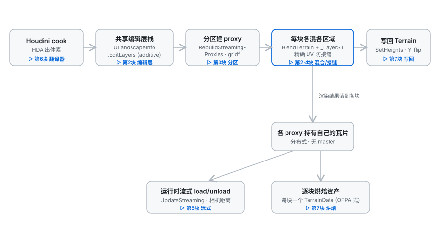
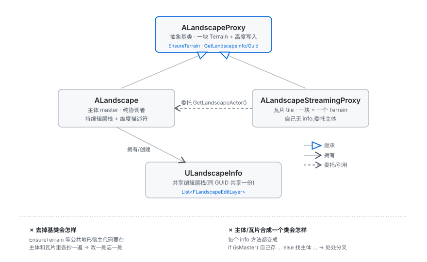

# 地形系统 ⟷ Unreal 逐块对比(中文)

> 本文把 Unity 这套 Houdini 地形/Landscape 系统的每一块逻辑,和 Unreal 的对应实现做横向对比,逐块给出:**我们的真实代码 → Unreal 对应结构 → 逐点对比 → 逻辑目的**。
>
> 一句话定位:**架构 = Unreal 分布式 Landscape;落地技巧 = MapMagic 瓦片;精度细节 = Terrain Toolbox 验证公式。**

---

## 0. 总览

整套管线(每个阶段对应下文的一块):



| 块 | 内容 | 关键文件 |
|---|---|---|
| 1 | 三类继承关系 | `ALandscapeProxy` / `ALandscape` / `ALandscapeStreamingProxy` / `ULandscapeInfo` |
| 2 | 编辑层 + 混合 | `FLandscapeEditLayer` · `ALandscape.BlendTerrain/GenerateHeightmap` · `EditLayerCombine.shader` |
| 3 | 分区 | `ALandscape.RebuildStreamingProxies / GetTileGrid` |
| 4 | 接缝 | `ALandscape.TileLayerST` |
| 5 | 运行时流式 | `ALandscape.UpdateStreaming / SetTileLoaded` |
| 6 | Houdini cook | `FHoudiniLandscapeTranslator` · `FHoudiniTileInfo` · `HEU_LandscapeUtility` |
| 7 | 写回 + 烘焙 | `ALandscape.ApplyRawHeightsToTerrain` · `HEU_LandscapeUtility.SaveTerrainDataToAssetCache` |

---

## 1. 三类继承关系



### 1.1 公共基类 `ALandscapeProxy`

```csharp
// 我们
public abstract class ALandscapeProxy : MonoBehaviour {
    public Terrain TerrainComponent { get; }                 // 懒加载 FindTerrain()
    protected virtual Terrain FindTerrain() => GetComponent<Terrain>();
    protected virtual GameObject EnsureTerrainHost() => gameObject;
    public Terrain EnsureTerrain() { ... }                   // 建 Terrain+Collider+默认材质
    public abstract ALandscape GetLandscapeActor();          // 子类必须答"主体是谁"
    public virtual Guid GetLandscapeGuid() => Guid.Empty;
    public virtual ULandscapeInfo GetLandscapeInfo() => null;
}
```
```cpp
// Unreal (LandscapeProxy.h)
class ALandscapeProxy : public AActor {
    FGuid LandscapeGuid;                                     // 共享身份
    TArray<ULandscapeComponent*> LandscapeComponents;        // 渲染几何单元(多个!)
    UMaterialInterface* LandscapeMaterial;
    int32 ComponentSizeQuads, SubsectionSizeQuads, NumSubsections;
    virtual ALandscape* GetLandscapeActor();
    ULandscapeInfo* GetLandscapeInfo() const;
};
```

| 点 | Unreal | 我们 | 为什么不同 |
|---|---|---|---|
| 引擎基类 | `AActor` | `MonoBehaviour` | 各自引擎的场景对象基类 |
| **几何** | `TArray<ULandscapeComponent>`(一块地形拆成很多 component,各自 culling/LOD) | **一个** `Terrain` | **根本差异**:Unity 的 `Terrain` 本身就是一整块带内置 LOD/patch 的高度图 → 一个 proxy = 一个 Terrain,不用再拆 component |
| `GetLandscapeActor` | 虚,子类答 | 抽象,子类答 | 一样(多态地基) |
| `FindTerrain`/`EnsureTerrainHost` | 无 | 我们加的 | Unity 特有:让 `ALandscape` 根上不挂 Terrain。Unreal 的 component 是独立 UObject、不挂 actor 上,天然没这问题 |

> **逻辑目的:** Unreal 一个 proxy 管一堆 component;我们一个 proxy 管一个 Terrain。几何模型不同,但上层(身份/info/多态)完全一致。

### 1.2 主体 `ALandscape`

```csharp
// 我们
public class ALandscape : ALandscapeProxy {
    protected override Terrain FindTerrain() => null;        // 纯协调者,自己没 Terrain
    [SerializeField] private ULandscapeInfo _landscapeInfo;  // 共享编辑层栈
    private Vector3 _landscapeSize; private int _landscapeResolution;   // 维度描述符
    public override ALandscape GetLandscapeActor() => this;
    public override ULandscapeInfo GetLandscapeInfo() => _landscapeInfo;
}
```
```cpp
// Unreal (Landscape.h)
class ALandscape : public ALandscapeProxy {
    virtual ALandscape* GetLandscapeActor() override { return this; }
#if WITH_EDITORONLY_DATA
    TArray<FLandscapeLayer> LandscapeLayers;                 // 编辑层栈(编辑器数据)
#endif
};
```

| 点 | Unreal | 我们 | 为什么 |
|---|---|---|---|
| `GetLandscapeActor` | `return this` | `return this` | 一样 |
| 编辑层 | `TArray<FLandscapeLayer>` 挂主体 | `ULandscapeInfo.EditLayers` 挂主体的 info | 我们塞进 info 对象更聚合,逻辑等价 |
| 几何 | World Partition 下主体几乎不持有 component | `FindTerrain()=>null`,根上无 Terrain | 同一精神:主体是协调者不是几何容器(为此删了 `Landscape_Master`) |
| 维度 | 引擎内建知道 landscape 尺寸 | 显式存 `_landscapeSize/_landscapeResolution` | Unity 无"landscape 尺寸"内建概念,proxy 又不存大图 → 主体显式记一份供切分/混合 |

### 1.3 流式块 `ALandscapeStreamingProxy`

```csharp
// 我们
public class ALandscapeStreamingProxy : ALandscapeProxy {
    private ALandscape _landscapeActor;
    public Vector2Int TileCoord;                             // 网格坐标
    public bool Ready => gameObject.activeInHierarchy;       // 加载=激活
    public override ALandscape GetLandscapeActor() => _landscapeActor;            // 委托主体
    public override ULandscapeInfo GetLandscapeInfo() => _landscapeActor?.GetLandscapeInfo();
}
```
```cpp
// Unreal (LandscapeStreamingProxy.h)
class ALandscapeStreamingProxy : public ALandscapeProxy {
    TLazyObjectPtr<ALandscape> LandscapeActor;
    virtual ALandscape* GetLandscapeActor() override { return LandscapeActor.Get(); }
};
```

| 点 | Unreal | 我们 | 为什么 |
|---|---|---|---|
| 指回主体 | `TLazyObjectPtr<ALandscape>` | `ALandscape _landscapeActor` | 一样(UE 用跨流式弱引用;我们直接引用) |
| `GetLandscapeActor` | `return LandscapeActor.Get()` | `return _landscapeActor` | 一样 |
| Info/Guid | 经 GetLandscapeActor 间接 | 显式重写委托 | 让多态访问 tile 时 info/guid 也答主体的,不是 null |
| 坐标/状态 | cell 坐标 + OFPA 流式态 | `TileCoord` + `Ready=activeInHierarchy` | Unity 无 cell/OFPA,用网格坐标 + 激活态表达 |

### 1.4 共享信息 `ULandscapeInfo` —— 把三者串成"一块地形"

```csharp
// 我们
public class ULandscapeInfo {
    public Guid LandscapeGuid { get; }
    public List<FLandscapeEditLayer> EditLayers;            // 共享编辑层栈
}
```
```cpp
// Unreal (LandscapeInfo.h)
class ULandscapeInfo : public UObject {
    TLazyObjectPtr<ALandscape> LandscapeActor;             // 主体
    TSet<TWeakObjectPtr<ALandscapeStreamingProxy>> StreamingProxies;  // 所有 proxy
    FGuid LandscapeGuid;
    void RegisterActor(ALandscapeProxy* Proxy, ...);
    // 在 ULandscapeInfoMap 里按 GUID 全局索引
};
```

| 点 | Unreal | 我们 | 为什么 |
|---|---|---|---|
| 谁持有 info | `ULandscapeInfoMap`(每 World 一张 GUID→Info 表) | 主体直接持有 `_landscapeInfo` | 最大简化:单地形不需全局表,proxy 经 `GetLandscapeActor().GetLandscapeInfo()` 拿 |
| info 记不记 proxy 列表 | `StreamingProxies` 集合 | 不记,用 `GetComponentsInChildren` 现拿 | Unity 里这个查询域重载后还正确,比手动列表(域重载清空)更稳 —— 故意不抄 Unreal |

> **逻辑目的(本块是"拆成多块为何还是一块地形"的答案):** 同一 `LandscapeGuid` + 同一份 `ULandscapeInfo.EditLayers`,所有 proxy 委托回来共享。

---

## 2. 编辑层 + 混合(整套的心脏)

### 2.1 编辑层数据模型 `FLandscapeEditLayer` ⟷ `FLandscapeLayer`

```csharp
// 我们 — 实现 IHeightModifier
public class FLandscapeEditLayer : IHeightModifier {
    public string Name;
    public bool   bVisible = true;                         // 隐藏=不参与混合
    public bool   bLocked  = false;                        // 锁=cook 不覆盖
    public HeightStamp.CombineMode CombineMode = Add;      // 高度层都是加法
    public float  Opacity = 1f;
    public Texture2D SavedHeight;                          // 持久化(挺过 scene reload)
    private Dictionary<Vector2Int, RenderTexture> TileHeightData;  // 运行时 GPU 高度
    public bool ApplyHeightStamp(...) { ... }              // "怎么把自己混进去"
}
```
```cpp
// Unreal (Landscape.h, WITH_EDITORONLY_DATA)
struct FLandscapeLayer {
    FName Name;  FGuid Guid;
    bool  bVisible = true;  bool bLocked = false;
    float HeightmapAlpha = 1.0f;                           // ≈ Opacity
    TEnumAsByte<ELandscapeBlendMode> BlendMode;            // LSBM_AdditiveBlend / LSBM_AlphaBlend
    TArray<FLandscapeLayerBrush> Brushes;
};
```

| 点 | Unreal `FLandscapeLayer` | 我们 `FLandscapeEditLayer` | 为什么 |
|---|---|---|---|
| 可见/锁 | `bVisible`/`bLocked` | 一样 | 隐藏=不混合,锁=cook 不覆盖 |
| 透明度 | `HeightmapAlpha` | `Opacity` | 一样 |
| 混合模式 | `ELandscapeBlendMode` | `CombineMode`(默认 Add) | 一样:高度层本质是加法叠加 |
| 层数据放哪 | per-component(分散) | per-tile `RenderTexture`(`TileHeightData`) | 几何模型差异,但都是"层 = 一张高度增量图" |
| 持久化 | 存进 landscape 资产 | `SavedHeight`(独立 `Texture2D` 资产) | Unity 没有 landscape 资产,自己存 |

> **逻辑目的:非破坏式叠加** —— 每层是高度**增量**,additive 求和;重 cook 某层、改可见性/透明度,都不动其他层。

### 2.2 统一抽象 `IHeightModifier`

```csharp
public interface IHeightModifier : IModifier {
    bool ApplyHeightStamp(RenderTexture source, RenderTexture dest, HeightmapData hd, OcclusionData od);
}
public interface IModifier { Bounds GetBounds(); bool IsEnabled(); void Initialize(); void Dispose(); }
```

`FLandscapeEditLayer`(Houdini 烤的层)和 Microverse 手刷 stamp **都实现 `IHeightModifier`** → 混合管线对"任何贡献高度的东西"一视同仁。对应 Unreal 的编辑层 + landscape brush(`ALandscapeBlueprintBrushBase`)统一贡献。

### 2.3 混合管线 `BlendTerrain` → `GenerateHeightmap` → `ApplyHeightStamp`

```csharp
// BlendTerrain:收集 modifier(编辑层 + 子 stamp)→ GenerateHeightmap → 写回
HeightmapData hd = new HeightmapData(terrain) { LayerST = layerST };   // 本块的子矩形
RenderTexture result = GenerateHeightmap(hd, _heightModifiers, terrainBounds, od);

// GenerateHeightmap:ping-pong 累加
foreach (modifier in modifiers) {
    if (!modifier.GetBounds().Intersects(terrainBounds)) continue;     // 范围裁剪
    if (modifier.ApplyHeightStamp(rt1, rt2, hd, od)) (rt1, rt2) = (rt2, rt1);
}

// ApplyHeightStamp(编辑层):一层混进累加器
_combineMaterial.SetTexture("_LayerTex", layerRT);
_combineMaterial.SetVector("_LayerST", hd.LayerST);        // ← 只采样本块那块子矩形(见第4块)
_combineMaterial.SetInt("_CombineMode", (int)CombineMode);
Graphics.Blit(source, dest, _combineMaterial);            // dest = source 加上 这一层
```
```cpp
// Unreal:逐 component 一个 GPU render pass,把每个可见层按 BlendMode 合成进该 component 的最终 heightmap;
//         只有脏掉的 component 才重算。
```

| 点 | Unreal | 我们 | 为什么 |
|---|---|---|---|
| 混合位置 | 引擎内部,逐 component GPU pass | `GenerateHeightmap` ping-pong RT,逐 proxy | Unity 无内建,手动用 shader 复刻 |
| 叠加方式 | 按 `BlendMode` | `EditLayerCombine.shader` 按 `CombineMode` | 一样 |
| 只算相关的 | 脏 component 才重算 | `GetBounds().Intersects` 跳过不相交的 | 一样精神 |
| 每块取自己区域 | 逐 component 天然只算自己 | `_LayerST` 让逐 proxy 采样自己 UV 子矩形 | **关键**:分布式落地;Unreal 靠 component 天然分,我们靠 UV 子矩形 |

> **一个关键小判断:** 编辑层栈"**定义**"了地形高度 —— 全隐藏就该变平(`FlattenTerrain`),否则"隐藏一层"看起来像没反应;完全没有栈则不动高度,免得清掉别人写的。

---

## 3. 分区 / World Partition

```csharp
public int WorldPartitionGridSize { get; set; }            // 来自 Houdini 属性,默认 4
void GetTileGrid(resolution, out gridSize, out tileQuads, out tileResolution) {
    int desired = ResolveGridSize(resolution);
    bool divides = desired > 1 && (resolution-1) % desired == 0 && Mathf.IsPowerOfTwo((resolution-1)/desired);
    gridSize       = divides ? desired : 1;       // ← 不能整除成 2^n 瓦片 → 退化 1×1
    tileQuads      = (resolution - 1) / gridSize;
    tileResolution = tileQuads + 1;               // ← Unity heightmap 必须 (2^n)+1
}
void RebuildStreamingProxies() {
    if (_landscapeResolution <= 0) return;
    ClearStreamingProxies();                              // destroy-and-rebuild
    GetTileGrid(_landscapeResolution, out grid, out _, out tileRes);
    Vector3 tileSize = _landscapeSize / grid;            // 每块世界尺寸
    for each (tileX, tileZ):
        建 "LandscapeStreamingProxy_x_z_0" 子物体, localPosition 摆位
        proxy.TileCoord = (x,z); proxy.EnsureTerrain(); 设 tileRes/tileSize;   // 空 terrain,无高度
        RegisterActor(proxy);                            // 连回主体共享 info
    SetNeighbors(每块的左右上下);                          // 缝合 LOD/法线
    RebuildHeightmap();                                  // 各块各混各的区域(第2块)
}
```
```cpp
// Unreal: ALandscape::SetWorldPartitionGridSize → World Partition 按 cell 建 ALandscapeStreamingProxy(OFPA),
//         component 分配到各 proxy。
```

| 点 | Unreal | 我们 | 为什么 |
|---|---|---|---|
| 网格参数 | `WorldPartitionGridSize`(Houdini 属性) | 同名,同 HAPI 常量,默认 4 | 1:1 搬 HAPI 约定 |
| 尺寸硬约束 | subsection+1 那套 | `tileResolution = tileQuads+1` 且 `tileQuads` 是 2^n | Unity heightmap 必须 (2^n)+1 → 驱动整除判断 |
| 不能整除时 | 引擎调 component 布局 | **退化 1×1**(整块=一个 proxy) | 关键设计:永远走 proxy 路径,无"非平铺裸 master"特例 → 上层不用 if 分叉 |
| 块的数据 | component 分配 | **空 terrain → 各自 blend**(不切片) | 分布式:每块自给自足 |
| 缝合 | 引擎 component 邻接 | `SetNeighbors`(对应 TT CalculateAdjacencies) | Unity Terrain 必须显式 `SetNeighbors`,否则边界裂 |

> **逻辑目的:** 把"想要的网格"和"Unity 的 (2^n)+1 硬约束"调和成 `(gridSize, tileQuads, tileResolution)`,切成 N×N 个独立流式 proxy,且保证至少 1×1。

---

## 4. 接缝(精确 UV)

```csharp
Vector4 TileLayerST(Vector2Int coord, int gridSize, int tileResolution) {
    int   tileQuads      = tileResolution - 1;
    float landscapeQuads = tileQuads * gridSize;          // = 全图分辨率 - 1
    float scale          = tileResolution / landscapeQuads;   // ← TT 的 resolution/(resolution+1) 等价
    float halfTexel      = 0.5f / landscapeQuads;             // ← 半 texel 修正
    float invGrid        = 1f / gridSize;
    float offsetU = coord.x * invGrid - halfTexel;
    float scaleV, offsetV;
    if (ShouldFlipY()) { scaleV = -scale; offsetV = (coord.y+1)*invGrid + halfTexel; }  // Y-flip 折进负 scale
    else               { scaleV =  scale; offsetV =  coord.y   *invGrid - halfTexel; }
    return new Vector4(scale, scaleV, offsetU, offsetV);
}
```
```cpp
// Unreal: 相邻 ULandscapeComponent 共享边界顶点行(那排顶点两块完全相同)→ 天然无缝
// Terrain Toolbox (ToolboxHelper.CopyTextureToTerrainHeight):
//   scale  = (resolution/(resolution+1)) * (div+1)/hWidth;
//   offset = (resolution/(resolution+1)) *  div   /hWidth;
```

| 点 | Unreal | 我们 | 为什么 |
|---|---|---|---|
| 无缝靠什么 | 数据层面:相邻 component 共享同排边界顶点 | 采样层面:相邻 tile 在共享边采到同一个 layer UV | 我们是 GPU 逐块采样,没有共享数据行 → 只能在 UV 上对齐 |
| 关键修正 | (component 天然对齐) | `tileRes/(res-1)` 缩放 + `halfTexel` 偏移 | naive `1/gridSize` 在边界差半 texel → 两块采到不同点 → 裂缝 |
| Y 翻转 | 无 | `ShouldFlipY()` 时 **scaleV 取负** + offset 换端 | readback 翻转使 V 轴相对世界 Z 反了;负 scale 把翻转折进采样,避免和 readback 双翻 |

> **逻辑目的:** 让纹素中心 `(x+0.5)/tileRes` 精确映射到 layer 顶点位置,使相邻两块在共享边采到完全相同的 layer UV → 高度逐字节一致 → 无缝。这是把 Unreal 的"共享顶点"用 GPU UV 等价实现,公式取自 Terrain Toolbox 的 shipping 代码。

---

## 5. 运行时流式

```csharp
[Header("Streaming")] public bool EnableStreaming = false;             // opt-in,默认关
public Transform StreamingFocus;
[Min(1f)] public float LoadRadius = 2000f, UnloadRadius = 2400f;       // 两半径之间是滞回

void Update() { if (EnableStreaming && Application.isPlaying) UpdateStreaming(); }   // 只在 Play 跑

void UpdateStreaming() {
    if (!TryGetStreamingFocus(out var focus)) return;             // 焦点:StreamingFocus / Camera.main / 编辑器相机
    if (focus 没怎么移动) return;                                  // 节流
    foreach (proxy in GetStreamingProxies()) {
        float d = TileFocusSqrDistance(proxy, focus);             // 到瓦片 footprint 最近点
        if (proxy.Ready) { if (d > unloadSqr) SetTileLoaded(proxy, false); }
        else if (d <= loadSqr) SetTileLoaded(proxy, true);
    }
}
// SetTileLoaded(load): SetActive(true) + TryLoadTile(blend 自己区域) / SetActive(false) + 释放 heightmap
```
```cpp
// Unreal: World Partition 按 streaming source(玩家/相机)到 cell 的距离 + loading range 自动 load/unload cell。
```

| 点 | Unreal | 我们 | 为什么 |
|---|---|---|---|
| 触发 | World Partition streaming source | 相机/`StreamingFocus` 距离 | 同思路;Unity 无 World Partition,自己写调度 |
| 阈值 | cell loading range | `LoadRadius` < `UnloadRadius`(滞回) | 两半径留间隙防边界反复抖动 |
| 加载时数据 | 从 cell 文件流入 | `TryLoadTile` → blend 自己区域 | 分布式:数据源是编辑层,重 blend 即可 |
| 卸载 | 卸 cell | `SetActive(false)` + heightmap 缩到 33 | 释放内存,重载再 blend |
| 只在 Play | 运行时 | `Application.isPlaying` 守卫 | 跟 MapMagic 一样,编辑器里不乱动 cook 出的瓦片 |
| 距离算法 | cell 包围盒 | footprint 最近点 | 大瓦片在脚下时不因中心远而卸载 |

> **逻辑目的:** 按相机就近 load/unload 瓦片,滞回防抖,加载时各块 blend 自己区域。World Partition 运行时流式在 Unity 的等价(opt-in,Phase 2)。

---

## 6. Houdini cook 管线

```csharp
// HEU 创建 landscape (HEU_LandscapeUtility.ResolveLandscapes)
ALandscape ls = go.AddComponent<ALandscape>();
ls.SetLandscapeGuid(NewGuid()); ls.CreateLandscapeInfo();
SetWorldPartitionGridSize(ls, heightPart.SizeInfo.WorldPartitionGridSize);
ls.SetLandscapeDescriptor(dims.x, dims.y, worldSize);    // 记尺寸/分辨率(无 master Terrain)

// 块信息 (FHoudiniHeightFieldPartData.cs)
struct FHoudiniTileInfo { Vector2Int TileStart; Vector2Int LandscapeDimensions; }   // 我在大图哪 + 大图多大

// 每个 Houdini part → 一个编辑层 (FHoudiniLandscapeTranslator.TranslateHeightFieldPart)
// cook 末尾:ReconcileEditLayerScales(); RebuildStreamingProxies();   // (第3块)
```
```cpp
// Unreal: HoudiniEngine 插件 FHoudiniLandscapeTranslator + FHoudiniTileInfo (HoudiniLandscapeUtils.h)
//   同样读 HAPI 属性 → 建 ALandscape + edit layers;TileStart/LandscapeDimensions 拼多块。
```

| 点 | Unreal HoudiniEngine | 我们(移植) | 为什么 |
|---|---|---|---|
| 翻译器 | `FHoudiniLandscapeTranslator` | 同名 | 1:1 移植 |
| 块信息 | `FHoudiniTileInfo`(TileStart + LandscapeDimensions) | 同名同字段 | 1:1:Houdini 一块块给,每块知道在大图哪、大图多大 |
| 编辑层类型 | `HAPI_..._EDITLAYER_TYPE_BASE/ADDITIVE` | 同名属性 | 1:1:base 绝对高度,additive 增量 |
| 分区/section 属性 | `unreal_landscape_partition_grid_size` 等 | 同 HAPI 常量 | 1:1 |
| base 怎么处理 | 建 landscape | 只 `SetLandscapeDescriptor` 记尺寸(base 自己也是编辑层) | Step 3:不再把 base 灌进 master |

> **逻辑目的:** 忠实搬 Houdini→Unreal 的 landscape 翻译:每个 part 变一个编辑层,属性约定照搬;多块用 `FHoudiniTileInfo` 定位拼成由 `LandscapeDimensions` 定义的大图。

---

## 7. 写回 + 烘焙

### 7.1 写回 `ApplyRawHeightsToTerrain`

```csharp
RenderTexture.active = rawHeight;
readback.ReadPixels(...); Color[] pixels = readback.GetPixels();        // GPU→CPU 读回
bool flipY = ShouldFlipY();                                             // 平台相关(非 Metal 且 UV 起点在上)
for y,x:
    int srcRow = (flipY ? height-1-y : y) * width;                      // Houdini 左上 → Unity 左下
    float h = pixels[srcRow + x].r;
    heights[y,x] = (float.IsNaN(h) || float.IsInfinity(h)) ? 0f : Mathf.Clamp01(h);  // NaN 清洗防尖刺
terrainData.SetHeights(0, 0, heights);
```
```cpp
// Unreal: 把层混合结果写进 landscape 的 heightmap 纹理(自有 16-bit 打包格式)。
```

| 点 | Unreal | 我们 | 为什么 |
|---|---|---|---|
| 写入路径 | 引擎内部 heightmap 纹理 | `SetHeights`(CPU 读回+写)而非 `CopyActiveRenderTextureToHeightmap` | 后者要匹配 Unity 打包格式,实测不可靠("缺一块/压平");`SetHeights` 同 Import Raw,可靠 |
| Y 翻转 | 无 | `flipY`(条件抄 TT) | Houdini 左上 vs Unity 左下 |
| 坏值 | (引擎保证) | NaN/Inf → 0 | `Mathf.Clamp01` 放过 NaN → 渲染成尖刺;清洗成平 |

### 7.2 烘焙 `SaveTerrainDataToAssetCache` ⟷ Unreal OFPA

```csharp
foreach (proxy in landscape.GetStreamingProxies()) {                   // 遍历 proxy 各存各的
    string name = $"{safeName}_{proxy.TileCoord.x}_{proxy.TileCoord.y}_TerrainData.asset";
    parentAsset.AddToAssetDBCache(name, proxy.TerrainComponent.terrainData, ...);   // 每块一个资产
}
```
```cpp
// Unreal: 每个 ALandscapeStreamingProxy 存为一个 actor 文件(OFPA, One File Per Actor)。
```

| 点 | Unreal | 我们 | 为什么 |
|---|---|---|---|
| 存储粒度 | 每 proxy 一个 actor 文件(OFPA) | 每 proxy 一个 `TerrainData` 资产 | 一样的分布式存储;Step 3 后从"存 master"改成逐 proxy |
| "合并成大图" | 单独的 Export Heightmap | 暂未做(可后加 `ExportMergedHeightmap`) | Unreal 里合并也只是按需导出,不是存储格式 |

> **逻辑目的:** 写回选 Unity 里最可靠的 `SetHeights` 路径 + NaN/翻转修正;烘焙按 OFPA 精神,每块独立存自己的 `TerrainData`,而非一张大图。

---

## 8. 全系统一句话回顾

| 块 | 一句话 |
|---|---|
| 1 三类 | `ALandscapeProxy`(基类)→ `ALandscape`(协调者)+ `ALandscapeStreamingProxy`(瓦片),`ULandscapeInfo` 用 GUID 串成"一块地形" |
| 2 编辑层+混合 | 每层是 additive 增量,`IHeightModifier` 统一,GPU ping-pong 累加,每块只混自己区域 |
| 3 分区 | 按 `WorldPartitionGridSize` 切 N×N proxy,永远≥1,(2^n)+1 约束驱动整除判断 |
| 4 接缝 | 精确 UV(TT 公式 + 半 texel + 负 scale 折翻转)= Unreal 共享顶点的 GPU 等价 |
| 5 流式 | 相机就近 load/unload + 滞回,加载时 blend 自己区域 = World Partition 等价 |
| 6 cook | `FHoudiniLandscapeTranslator`/`FHoudiniTileInfo` 1:1 搬 Houdini Engine |
| 7 写回+烘焙 | `SetHeights`(可靠)+ NaN/翻转修正;逐 proxy 存 `TerrainData` = OFPA 精神 |

---

## 附录 A:怎么读 Unreal 源码

C++ 把代码**拆成两半** —— 这就是"在 .h 里找不到逻辑"的原因:

| 文件 | 在哪 | 装什么 |
|---|---|---|
| **`.h` 头文件** | `…/Landscape/Classes/`(或 `Public/`) | **只有声明**:方法签名,后面是分号,**没有 `{...}`** |
| **`.cpp` 实现** | `…/Landscape/**Private**/` | **逻辑**:方法体 `{...}` 在这 |

例:`Classes/LandscapeProxy.h:1212`
```cpp
virtual ULandscapeInfo* GetLandscapeInfo() const override;   // 只有声明,没逻辑
```
逻辑在 `Private/Landscape.cpp:1773`
```cpp
ULandscapeInfo* ALandscapeProxy::GetLandscapeInfo() const {
    return ULandscapeInfo::Find(GetWorld(), LandscapeGuid);
}
```

**从声明跳到逻辑的方法:**
1. 在 .h 里记下 `类名::方法名`(如 `ALandscapeProxy::GetLandscapeInfo`)。
2. 去 `Private/` 文件夹,**全文搜 `类名::方法名`**。
3. ⚠️ 实现文件名**不一定和 .h 同名** —— `ALandscapeStreamingProxy` 的实现在 `Landscape.cpp` 里,不在 `LandscapeStreamingProxy.cpp`。所以**搜 `类名::方法名` 比按文件名找靠谱**。
4. 特例:很简单的方法会直接在 .h 里 inline 写 `{...}`(如 `{ return this; }`);复杂逻辑都在 .cpp。

> 路径对照:声明 `Classes/*.h` ←→ 逻辑 `Private/*.cpp`。

## 附录 B:核心方法 / 概念详解(对照 UE 5.5 真实代码)

### B.1 "委托"(delegation)是什么

> ⚠️ 这里的"委托" = **设计模式的委托(转发调用)**,**不是** Unreal 的事件系统 `DECLARE_DELEGATE`/`FDelegate`(那是回调那种"委托")。中文同名,完全两码事。

委托 = "**我不自己做这件事,转交给另一个对象做**"。看 Unreal 实际代码(`Private/Landscape.cpp`):
```cpp
// 主体:被问"你的主体是谁" → 答"我自己"
ALandscape* ALandscape::GetLandscapeActor() { return this; }                       // :1704
// 瓦片:不自己存身份,转交给它持有的主体引用来回答 —— 这就是委托
ALandscape* ALandscapeStreamingProxy::GetLandscapeActor() { return LandscapeActorRef.Get(); }  // :1714
void        ALandscapeStreamingProxy::SetLandscapeActor(ALandscape* In) { LandscapeActorRef = In; }  // :1719
```
我们的 C# 完全一样:`_landscapeActor`(= UE 的 `LandscapeActorRef`),`GetLandscapeActor() => _landscapeActor`。

### B.2 `GetLandscapeActor`

回答"这块地形的**主体**(总指挥 `ALandscape`)是谁"。主体答自己(`return this`),瓦片委托给主体引用。一块地形切成多个 proxy,任一 proxy 都能用它找回主体。

### B.3 `GetLandscapeInfo`

回答"这块地形的**共享信息对象** `ULandscapeInfo`(身份 GUID + 图层信息)是谁"。Unreal 拿自己的 GUID 去**全局表** `ULandscapeInfoMap` 查:
```cpp
// :1773 / :1766
ULandscapeInfo* ALandscapeProxy::GetLandscapeInfo() const { return ULandscapeInfo::Find(GetWorld(), LandscapeGuid); }
ULandscapeInfo* ALandscapeProxy::CreateLandscapeInfo(...) {
    ULandscapeInfo* Info = ULandscapeInfo::FindOrCreate(GetWorld(), LandscapeGuid);
    Info->RegisterActor(this, ...);  return Info;
}
```
**同一个 GUID 的所有 proxy,查到的是同一个 Info** → 这就是"拆成多块、却还是一块地形"。我们简化:主体直接持有 `_landscapeInfo`,瓦片委托给主体。

### B.4 基类方法分两类

`ALandscapeProxy` 基类 = "任何地形碎片都该会做的事"的契约(`LandscapeProxy.h`):
```cpp
virtual ALandscape* GetLandscapeActor() PURE_VIRTUAL(...);   // :1110 纯虚 = C# 的 abstract,逼子类实现
```
- **镜像 Unreal 的**:`GetLandscapeActor`/`GetLandscapeInfo`/`GetLandscapeGuid`(身份与归属)。
- **Unity 特有的**:`TerrainComponent`/`FindTerrain`/`EnsureTerrain`("我有一块 Unity `Terrain`、怎么建它");Unreal 没有(它用 component 数组)。

> 真实源码路径:`D:\UnrealEditor\UE_5.5\Engine\Source\Runtime\Landscape\{Classes\*.h, Private\*.cpp}`。

---

## 9. 我的笔记 / 待办(可续写)

> 这一节留给你自己记录后续的问题、结论、TODO。

- [ ]
- [ ]

### 待澄清的问题

-

### 已确认的结论

-
